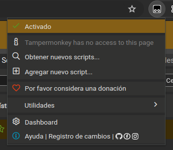

ventas diarias globlales

# AFIP_CompletaFormulario

Este proyecto, desarrollado en JavaScript, está diseñado para automatizar el llenado de diversos formularios con el objetivo de generar facturas electrónicas tanto de tipo "B" o "C" como si es del tipo "Producto" o "Servicio". Se optó por esta implementación debido a un comunicado emitido por la misma entidad advirtiendo el uso de frameworks como Selenium u otros para la automatización del llenado de formularios, castigando con posibles sanciones.

---

### Descripción de la solución

Dado un listado de montos totales por dia y la tipificacion necesaria generar la facturacion correspondiente. La solución consiste en pequeños bloques de código que unidos pueden lograr la automatizacion de dicha tarea, teniendo en cuenta que de ser necesario se subdividiran el monto total de un dia en varias facturas. Dichos bloques de código pueden ejecutarse de las siguientes maneras:
- En la consola del navegador.
- Como snippets en Google Chrome.
- A través de plugins del navegador como Tampermonkey® u otros.

Tener en cuenta que esta solucion trabaja con los monto de la factura que no exceden el límite establecido por dicha entidad para facturas sin registrar los datos del comprador, ya que de hacerlo generará un detenimiento en la ejecución y aparecerá una ventana emergente en la que se le indicará que por el monto facturado deberá registrar los datos del receptor para continuar. Para evitar esto, una de las opciones es descomponer el monto deseado en varias facturas.

### Requisitos
Para que todo funcione correctamente se debe seguir unos pasos que se trataran de describir a continuacion 
- Tener el listado de montos totales diarios, de un mes en especifico 
- Tener claro la tipificacion de la factura a realizar si es "B" o "C" y si es del tipo "Producto" o "Servicio"

Con estos datos comenzamos con el script que se llama "creadorArrayDatos.js" en el cual se deberan agregar los datos actualizados correspondientes en el inicio del archivo se vera de esta manera:

```javascript
const configuracion = {
    montoMaximo: 95812,
    anio: "2024",
    mesEnCurso: "05"
};

let montoFactura = [
    958813, 186001, 189600, 186530, 185360, 187560, 184520,
    285420, 184052, 286391, 199891, 146281, 171381, 268341,
    //otros montos correspondiente a otros dias 
    156801, 196381, 284281
];

```

---

Para ejecutar este código, sigue estos pasos en tu navegador preferido:

1. **Actualizar y preparar el código**: Asegúrate de haber actualizado el código con la información necesaria.

2. **Abrir la consola del navegador**: Presiona F12 para abrir las herramientas de desarrollador del navegador. Luego, selecciona la pestaña "Consola".

3. **Permitir el pegado en la consola (si es necesario)**: Si es la primera vez que usas la consola del navegador, es posible que necesites habilitar el pegado de contenido. Dependiendo del navegador, la consola te guiará sobre cómo otorgar permisos para pegar. Esto se debe a las políticas de seguridad del navegador.

4. **Pegar y ejecutar el código**: Una vez que hayas permitido el pegado, pega todo el código actualizado en la consola y presiona "Enter". Verás que se ejecuta el código y en la consola aparecerán las comprobaciones, como el monto total inicial y final, así como cualquier error durante el proceso.

5. **Copiar la estructura de datos**: La salida del código incluirá una estructura con el formato `["fecha", monto]`, que llamaremos 'fechaMonto'. Cópialo al portapapeles porque lo usarás más adelante.

---

**Siguiente paso: Actualizar y ejecutar el script para guardar datos**

1. **Abrir el archivo 'Crear-Formatear_Datos.js' y configurar los datos iniciales**: 
   - Abre el archivo 'Crear-Formatear_Datos.js'.
   - Configura los primeros datos según sea necesario.
   - Pega el array 'fechaMonto' obtenido en la ejecución anterior entre los corchetes correspondientes.

2. **Descomentar opciones necesarias**: 
   - En el archivo 'Crear-Formatear_Datos.js', asegúrate de descomentar una de las opciones tanto en 'datosDeEmision' como en 'datosDeOperacion', siguiendo el ejemplo proporcionado.

3. **Copiar y ejecutar el código actualizado en la consola del navegador**: 
   - Copia todo el código actualizado del archivo 'Crear-Formatear_Datos.js'.
   - Abre la consola del navegador (F12 -> Consola).
   - Pega el código copiado en la consola y presiona "Enter" para ejecutarlo.
   - Esta acción guardará los valores ingresados en el almacenamiento local del navegador.

---


```js
let arrayDatos = [
    ["25/06/2024", 5000],
    // otros elementos...
    ["25/06/2024", 10000],
];

//descomentar segun se requiera 

let datosDeEmision = 'producto';
//let datosDeEmision = 'servicio';


//let datosDeOperacion = 'Factura_B';
let datosDeOperacion = 'Factura_C';
```

---

### generar Facturas 

1. **Acceder al portal de AFIP:** Ingrese con sus credenciales al portal de AFIP y seleccione "Comprobantes en Línea".
2. **Iniciar en el sistema RCEL:** Una vez dentro del sistema "RCEL", se mostrará el siguiente menú:
    

Dos maneras propuestas y explicadas para continuar 

**Utilizando la consola del navegador para autocompletar formularios**

1. **Preparar el script 'ConsolaNavegador.js'**: Asegúrate de tener listo el script 'ConsolaNavegador.js', el cual contiene las funciones para rellenar los formularios automáticamente.

2. **Ejecutar el script en la consola del navegador**:
   - Abre la consola del navegador (F12 -> Consola).
   - Pega todo el código del script 'ConsolaNavegador.js' en la consola y presiona "Enter".
   - El navegador mostrará el siguiente formulario para autocompletar.
   - Para volver a rellenar el formulario actual, usa la flecha hacia arriba del teclado para recuperar el código anterior en la consola y presiona "Enter" nuevamente.
   - Repite este proceso sucesivamente hasta que hayas generado todas las facturas que están en el array de datos.

---

**Configuración de Tampermonkey para la ejecución automática de formularios**

1. **Instalar Tampermonkey**: Desde la tienda de extensiones de su navegador, instala Tampermonkey, disponible en la mayoría de los navegadores.

2. **Agregar y configurar el script**:
   - Después de la instalación, haz clic en el ícono de Tampermonkey y selecciona "Agregar un nuevo script".
   - Copia el contenido del script "Tampermonkey.js" y pégalo en el editor, reemplazando cualquier código preexistente.


3. **Configurar la inclusión del script**:
   - Guarda el script. Ve a la pestaña "Configuración" y luego a "Incluye".
   - Ingresa el siguiente patrón en el campo de inclusión y haz clic en el botón de guardado:
     ```sh
     http://*/RCEL*
     ```

4. **Activar el script**:
   - En la lista de scripts, asegúrate de que el script esté marcado como activo.
   - Configura las opciones según se muestra en las imágenes: asegúrate de que esté seleccionado y activado.


5. **Verificar la activación**:
   - Verifica que el icono de Tampermonkey en la barra del navegador esté activo y mostrando que el script está en funcionamiento.



6. **Ejecución automática**:
   - Una vez configurado, cuando el navegador cargue la ventana de "RCEL", el script comenzará automáticamente a completar los diferentes formularios hasta procesar todos los datos del array.

---

**Sugerencias adicionales para pruebas antes de ejecutar en producción:**

Antes de ejecutar los scripts en un entorno de producción, se recomienda realizar pruebas en un entorno de prueba para garantizar el funcionamiento correcto. Aquí hay dos sugerencias para realizar pruebas de manera segura:

1. **Opción 1 - Verificación de datos finales de la factura:**
   - Para detener la ejecución en un punto clave y revisar los datos antes de confirmar la factura, comenta la siguiente línea de código como se muestra a continuación:
   
   **Código original:**
   ```javascript
   //paso5_ConfirmarFactura
   if (window.location.href.includes('genComResumenDatos')) {
   ```
   
   **Código comentado para prueba:**
   ```javascript
   //paso5_ConfirmarFactura
   // if (window.location.href.includes('genComResumenDatos')) {
   ```
   
2. **Opción 2 - Verificación de la iteración entre facturas:**
   - Para verificar que la iteración entre las facturas sea correcta, comenta la siguiente línea de código como se muestra a continuación:
   
   **Código original:**
   ```javascript
   //paso5_ConfirmarFactura
   if (window.location.href.includes('genComResumenDatos')) {
       esperarElementoEnDOM("#impuestos")
           .then((elemento) => {
               window.scrollTo(0, document.body.scrollHeight);
               ajaxFunction()
   ```
   
   **Código comentado para prueba:**
   ```javascript
   // ajaxFunction()
   ```
   
Una vez completadas las pruebas y verificaciones necesarias, asegúrate de restaurar las líneas de código comentadas a su estado original. Esto se puede hacer descomentando las líneas modificadas y además ejecutando el script "Crear-Formatear_Datos.js" en la consola del navegador para restablecer las variables en el almacenamiento local y asegurar el correcto funcionamiento del programa.

